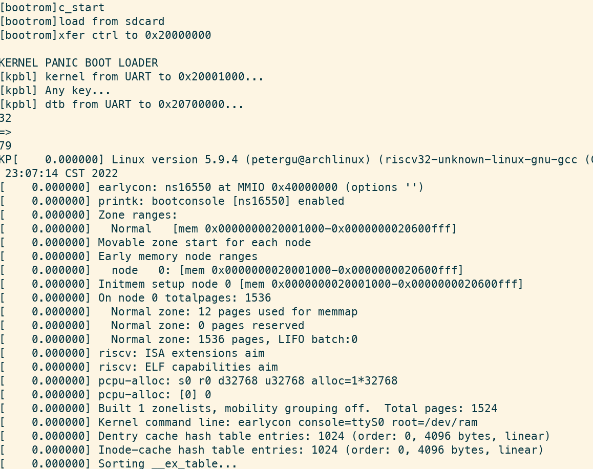
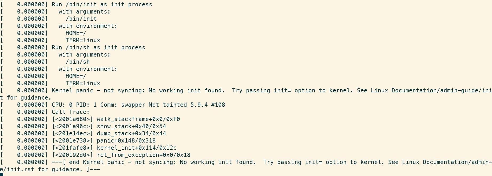

## Quasi SoC

Crappy RISC-V CPU and fancy peripherals designed to be useful. Linux kernel capable. Free-software toolchain ready. Prioritize compatibility and easy-to-understand -- if I can write this, you also can. 

#### ∂CPU (partial CPU)

- [x] Multiple-cycle RISC-V RV32IMA\* Zicsr\* @ 62.5 MHz, ~0.27 CoreMark/MHz
- [x] M-mode, interrupt, exception\*
  - [ ] Core local interrupt controller(CLINT, for mtime and software interrupt)
- [x] Memory-mapped IO bus (1 host, multiple guests)

Future plan

- [ ] Bus arbitration
- [ ] Platform-level interrupt controller(PLIC, for external interrupt)
- [ ] Sv32 MMU
- [ ] S-mode and U-mode
- [ ] GDB debug over openocd JTAG
- [ ] PMP (not planned)
- [ ] Formal verification (not planned)
- [ ] Pipeline (not planned)

  \*: except amo(max|min)u?

  \*: may not be exactly standard, stuffs like vectored interrupt not supported

  \*: stuffs like illegal instruction not supported

#### Peripherals

- [x] ESP-PSRAM64H as main memory, 8 MB, QPI mode @ 62.5 M, burst R/W
- [x] ~~Cache, direct mapping 32 KB(configurable)~~ has bugs
- [ ] SDRAM (Easy but not before I get a better board)
- [x] GPIO (LEDs, buttons, switches)
- [x] UART (115200/921600 baud), boot from UART, rest from UART
- [x] SD card (SPI mode, SDHC)
- [x] PS/2 keyboard
- [x] HDMI
  - [x] Character terminal
  - [x] Frame buffer graphics, 320x240 8-bit color or 640x480 2-bit monochrome
  - [ ] Quality of life fixes
- [x] CH375 USB disk
- [x] W5500 ethernet module
- [ ] **Bus converter**: Use AXI/Wishbone peripherals
- [x] **Hart transplant**: Use other RISC-V cores with my peripherals

Future plan

- [ ] Internet connectivity
  - [ ] LAN8720 ethernet module w/ RGMII (Hard)
  - [ ] ESP8266/ESP32 Wifi module (Boring)
  - [ ] lwIP? Need MAC + PHY(ENC28J60?) I guess...

#### Software

- [x] **Linux kernel** 32-bit NOMMU uClibc
  - [ ] Drivers for my UART
  - [ ] Busybox "userspace"
- [x] **MicroPython** [port](https://github.com/regymm/micropython/tree/master/ports/QuasiSoC)

Misc

- [x] Standard RISC-V toolchain for RV32IM Newlib
- [x] Basic RISC-V [tests](https://github.com/cliffordwolf/picorv32/tree/master/tests) 
- [x] **CoreMark** performance approx. 0.27 CoreMark/MHz
- [x] Fancy but very slow **[soft renderer](https://github.com/fededevi/pingo/)**

#### Boards & FPGAs

Xilinx 7 series

- [x] xc7z010 PL @ SqueakyBoard, main dev platform [ref](https://github.com/ustcpetergu/SqueakyBoard)
- [x] xc7z020 PL @ PYNQ-Z1 w/ extension PMOD module [ref](https://reference.digilentinc.com/programmable-logic/pynq-z1/start)
- [x] xc7k325t @ Memblaze PBlaze 3 w/ extension board  [ref](https://www.tweaktown.com/reviews/6797/memblaze-pblaze3l-1-2tb-enterprise-pcie-ssd-review/index.html)
- [x] xc7a100t @ Nexys A7 on [USTC FPGAOL](fpgaol.ustc.edu.cn), SW/LED/UART/UARTBOOT [Instructions](fpgaol.md)

- [x] Xilinx 7-series w/ Symbiflow (partial)

Xilinx Spartan 6

- [x] xc6slx16 @ Nameless LED controller module

Others

- [ ] ep4ce15 @ QMTech core board w/ SDRAM [ref](http://land-boards.com/blwiki/index.php?title=QMTECH_EP4CE15_FPGA_Card)
- [ ] ep2c35 @ Cisco HWIC-3G-CDMA router module [ref](https://github.com/tomverbeure/cisco-hwic-3g-cdma)
- [ ] K210 or some other hardcore RISCV

- [ ] lfe5u or iCE40 w/ free software toolchain(Symbiflow, icestorm)

#### Build & Run

*Quick start*

[Build & run instructions](BuildnRun.md)

*Free-as-in-freedom*

[Free software toolchain -- SymbiFlow(Vivado-free!)](SymbiFlow.md)

#### Linux Kernel

*At least you saw a fancy kernel panic.*

[It's hacky, dirty, hard, and of no practical use](Linux.md)

#### Alternative RISC-V Cores

*Use other RISC-V cores with Quasi SoC peripherals. Currently supports PicoRV32.*

[Hard Transplant](HartTransplant.md)

#### Gallery

Linux kernel booting, init not ready yet, 8 MB RAM is enough for everything. 

Pingo soft renderer of Viking room, with testing color strips, on HDMI monitor.

Ported MicroPython, on HDMI monitor.

CoreMark benchmarking, serial port.

<!--
Process switching demo and inter-process communication, early-stage microkernel osdev, serial port.

-->

#### Credits

Many peripherals' code are based on other's work. If I miss something please point out. 

[HDMI module](https://github.com/hdl-util/hdmi), modified

[HDMI module](https://www.fpga4fun.com/HDMI.html)

[SD card module](http://web.mit.edu/6.111/volume2/www/f2018/tools/sd_controller.v), [modified](https://github.com/regymm/mit_sd_controller_improved)

[UART module](https://github.com/jamieiles/uart), heavily modified

[Computer Organization and Design](https://enszhou.github.io/cod/), where everything started

#### License

GPL-V3

