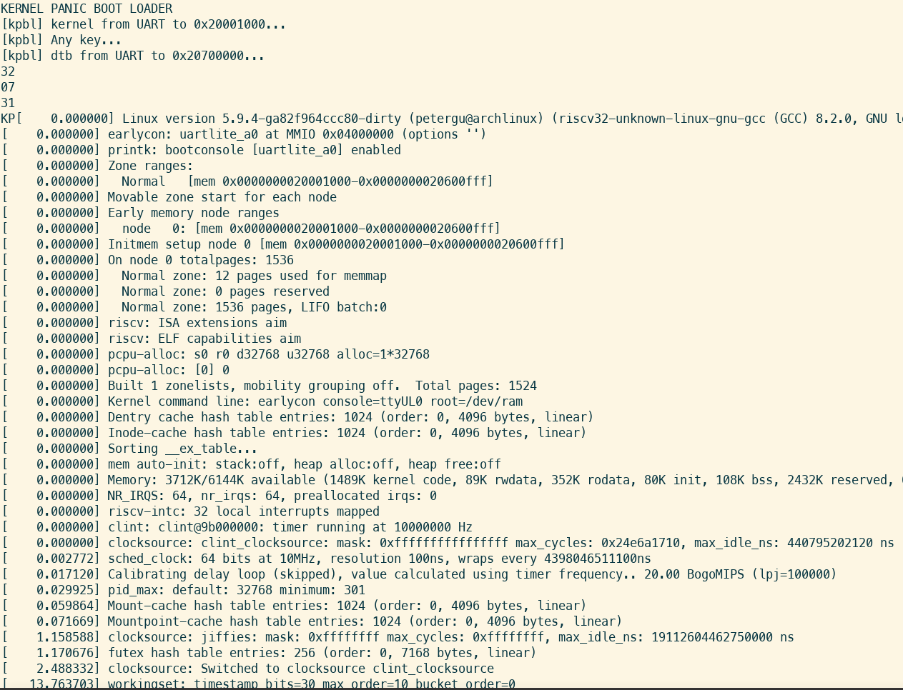
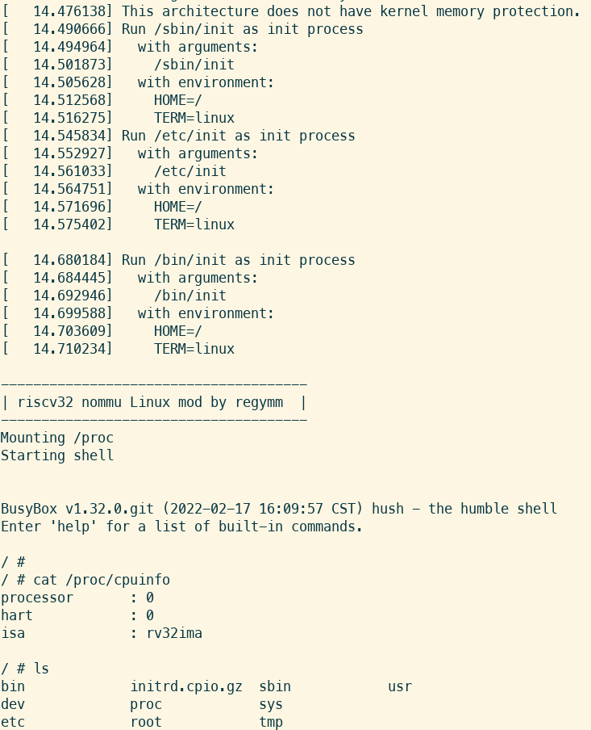

## Quasi SoC

Crappy RISC-V CPU and fancy peripherals designed to be useful. No-MMU Linux capable. Free-software toolchain ready. Prioritize compatibility and easy-to-understand -- if I can write this, you also can. 

### ∂CPU (partial CPU)

- [x] Multiple-cycle RISC-V RV32IMA\* Zicsr\* @ 62.5 MHz, ~0.27 CoreMark/MHz
- [x] M-mode, interrupt, exception\*
  - [x] Core local interrupt controller(CLINT, for mtime and ~~software~~ interrupt)
  - [ ] Platform-level interrupt controller(PLIC, for external interrupt)
- [x] U-mode\*
- [x] Memory-mapped IO bus
  - [ ] with arbitration and DMA
- [x] Cache, direct mapping(configurable, 32 KB default)

&nbsp;&nbsp;  \*: except amo(max|min)u?  
&nbsp;&nbsp;  \*: may not be exactly standard, stuffs like vectored interrupt not supported  
&nbsp;&nbsp;  \*: stuffs like illegal instruction not supported  
&nbsp;&nbsp;  \*: only MPP field in mstatus, which is enough 

Future plan

- [ ] Illegal instruction/load/store exception
- [ ] Optimize memory access cycles
- [ ] Sv32 MMU
- [ ] S-mode
- [ ] GDB debug over openocd JTAG
- [ ] faster M instructions
- [ ] Formal verification
- [ ] amo(max|min)u? (Linux doesn't use, not planned)
- [ ] IO bus w/ burst (hard, not planned)
- [ ] U-mode memory protection (like PMP?) (not planned)
- [ ] Pipeline (not planned)

### Peripherals

- [x] AXI MIG DDR2/DDR3
- [x] ESP-PSRAM64H (8 MB) QPI mode @ 62.5 M, burst R/W
- [ ] SDRAM
- [x] GPIO (LEDs, buttons, switches)
- [x] UART (115200/921600/1843200 baud), boot from UART, rest from UART
- [x] SD card (SPI mode, SDHC)
- [x] PS/2 keyboard
- [ ] PS/2 mouse
- [x] Graphics
  - [x] HDMI, character terminal, frame buffer graphics(320x240 8-bit color, 640x480 2-bit monochrome)
    - [ ] Quality of life fixes
  - [ ] Old good VGA
  - [x] ILI9486 480x320 LCD
    - [ ] Refresh rate upgrade
- [x] CH375 USB disk
- [x] W5500 ethernet module
  - [ ] W5500 as MAC with LwIP stack
- [x] **Bus arbitration**: Multiple hosts, "DMA"
- [x] **Bus converter**: Use AXI peripherals
- [x] **Hart transplant**: Use other RISC-V cores with my peripherals
- [ ] **Xeno transplant**: Use ARM or x86 cores with my peripherals

Future plan

- [ ] Internet connectivity
  - [ ] LAN8720 module w/ RGMII PHY (need FPGA MAC)
  - [ ] ESP8266/ESP32 Wifi module (Boring and assaulting)
  - [ ] ENC28J60
  - [ ] LwIP stack
- [ ] USB capability
  - [ ] Host controller, like SL811
  - [ ] USB3300/TUSB1210 ULPI PHY (need FPGA host)
  - [ ] Driver for classes(HID, HUB, Mass Storage)

### Software

- [x] **Linux kernel** 32-bit No-MMU uClibc
  - [x] busybox userspace
  - [x] driver for my UART
- [x] **MicroPython** [port](https://github.com/regymm/micropython/tree/master/ports/QuasiSoC)

Misc

- [x] Standard RISC-V toolchain and ASM/C programming for RV32IM Newlib
- [x] Basic RISC-V [tests](https://github.com/cliffordwolf/picorv32/tree/master/tests) 
- [x] **CoreMark** performance approx. 0.27 CoreMark/MHz
- [x] Fancy but very slow **[soft renderer](https://github.com/fededevi/pingo/)**
- [x] Bad Apple!! on LCD(low quality)
- [ ] Bad Apple!! on HDMI

### Boards & FPGAs

Xilinx 7 series

- [x] xc7a200t @ Nexys Video, main dev platform [ref](https://digilent.com/reference/programmable-logic/nexys-video/start)
- [x] xc7z010 PL @ SqueakyBoard, previous main dev platform [ref](https://github.com/ustcpetergu/SqueakyBoard)
- [x] xc7z020 PL @ PYNQ-Z1 w/ extension PMOD module [ref](https://reference.digilentinc.com/programmable-logic/pynq-z1/start)
- [x] xc7k325t @ Memblaze PBlaze 3 w/ extension board  [ref](https://www.tweaktown.com/reviews/6797/memblaze-pblaze3l-1-2tb-enterprise-pcie-ssd-review/index.html)
- [x] xc7a100t @ Nexys A7 on [USTC FPGAOL](fpgaol.ustc.edu.cn), SW/LED/UART/UARTBOOT [Instructions](fpgaol.md)
- [x] Xilinx 7-series w/ Symbiflow (partial)

Others

- [x] xc6slx16 @ Nameless LED controller module, deprecated
- [ ] ep4ce15 @ QMTech core board w/ SDRAM [ref](http://land-boards.com/blwiki/index.php?title=QMTECH_EP4CE15_FPGA_Card)
- [ ] ep2c35 @ Cisco HWIC-3G-CDMA router module [ref](https://github.com/tomverbeure/cisco-hwic-3g-cdma)
- [ ] lfe5u-12f @ mystery module
- [ ] K210 or some other hardcore RISCV
- [ ] lfe5u or iCE40 w/ free software toolchain(Symbiflow, icestorm)

### Build & Run

*Boardless start* 
[Simulation](Simulation.md)

*Quick start* 
[Build & run instructions](BuildnRun.md)

*Free-as-in-freedom* 
[Free software toolchain -- SymbiFlow(Vivado-free!)](SymbiFlow.md)

### Linux Kernel

*At least you saw a fancy kernel panic.* 
[It's hacky and dirty(TODO)](Linux.md)

### Alternative RISC-V Cores

*Use other RISC-V cores with Quasi SoC peripherals. Currently supports PicoRV32.* 
[Hart Transplant](HartTransplant.md)

### Gallery

Linux kernel and busybox, 8 MB RAM is enough for everything. 

Pingo soft renderer of Viking room, with testing color strips, on HDMI monitor.

Ported MicroPython, on HDMI monitor.

CoreMark benchmarking, serial port.

<!--
Process switching demo and inter-process communication, early-stage microkernel osdev, serial port.

-->

### Credits

Many peripherals' code are based on other's work. If I miss something please point out. 

[HDMI module](https://github.com/hdl-util/hdmi), modified

[HDMI module](https://www.fpga4fun.com/HDMI.html)

[SD card module](http://web.mit.edu/6.111/volume2/www/f2018/tools/sd_controller.v), [modified](https://github.com/regymm/mit_sd_controller_improved)

[UART module](https://github.com/jamieiles/uart), heavily modified

[Computer Organization and Design](https://enszhou.github.io/cod/), where everything started

### License

GPL-V3

