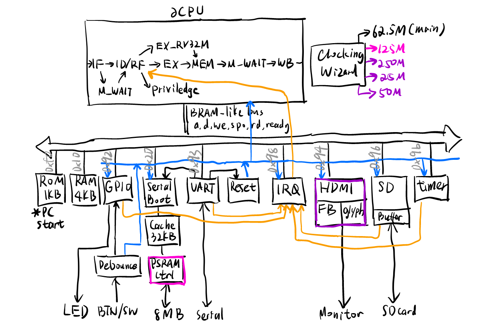

## Quasi SoC

Crappy RISC-V CPU and fancy peripherals designed to be useful. Always half-baked. Prioritize compatibility over performance. Free-software toolchain ready. 

#### ∂CPU (partial CPU)

- [x] Multiple-cycle RISC-V RV32IM @ 62.5 MHz
- [x] M-mode CSR (partial but enough)
- [x] Interrupt (timer, external, software)
- [x] Exception (ecall, break, partial invalid instructions)
- [ ] Atomic extention (hardware or trap-based)
- [ ] Sv32 MMU
- [ ] S-mode CSR
- [x] Memory-mapped IO (1 host, multiple guests)
- [ ] Bus arbitration (multiple hosts, graphics unit or debugger)
- [ ] Formal verification (not planned)
- [ ] Pipeline (not planned)
- [ ] Supervisor/User privilege level support (not planned)
- [ ] GDB debug over openocd JTAG

#### Peripherals

- [x] ESP-PSRAM64H as main memory, 8 MB, QPI mode @ 62.5 M, burst R/W
- [x] Cache, direct mapping 32 KB(configurable)
- [ ] SDRAM (Easy but not before I get a better board)
- [x] GPIO (LEDs, buttons, switches)
- [x] UART (921600 baud), load assembly from UART, reset CPU from UART
- [x] SD card (SPI mode, SDHC)
- [x] PS/2 keyboard
- [x] HDMI character terminal
- [x] HDMI frame buffer graphics, 320x240 8-bit color or 640x480 2-bit monochrome
- [ ] HDMI quality of life
- [x] CH375 Serial, USB disk support
- [x] W5500 ethernet module
- [ ] LAN8720 ethernet module w/ RGMII (Hard)
- [ ] ESP8266/ESP32 Wifi module (Boring)
- [ ] lwIP? Need MAC + PHY(ENC28J60?) I guess...
- [x] Interrupt Timer
- [ ] Bus converter to use AXI/Wishbone peripherals
- [x] **Hart transplant**: use other RISC-V cores with Quasi SoC peripherals

#### Software

- [x] Standard RISC-V toolchain for RV32IM Newlib
- [x] Basic RISC-V [tests](https://github.com/cliffordwolf/picorv32/tree/master/tests) passed
- [x] CoreMark performance approx. 0.27 CoreMark/MHz
- [x] MicroPython [port](https://github.com/regymm/micropython/tree/master/ports/pComputer), deprecated, TODO: update
- [x] Fancy but very slow [soft renderer](https://github.com/fededevi/pingo/)
- [ ] Linux-capable **long-term**

#### Boards & FPGAs

- [x] xc7z010 PL @ SqueakyBoard, main dev platform [ref](https://github.com/ustcpetergu/SqueakyBoard)
- [x] xc7z020 PL @ PYNQ-Z1 w/ extension PMOD module [ref](https://reference.digilentinc.com/programmable-logic/pynq-z1/start)
- [x] xc7k325t @ Memblaze PBlaze 3 w/ extension board  [ref](https://www.tweaktown.com/reviews/6797/memblaze-pblaze3l-1-2tb-enterprise-pcie-ssd-review/index.html)
- [x] xc6slx16 @ Nameless LED controller module, UART only
- [ ] ep4ce15 @ QMTech core board w/ SDRAM [ref](http://land-boards.com/blwiki/index.php?title=QMTECH_EP4CE15_FPGA_Card)
- [ ] ep2c35 @ Cisco HWIC-3G-CDMA router module [ref](https://github.com/tomverbeure/cisco-hwic-3g-cdma)
- [x] Xilinx 7-series w/ Symbiflow (partial)
- [ ] lfe5u or iCE40 w/ free software toolchain(Symbiflow, icestorm)
- [ ] K210 or some other hardcore RISCV
- [x] xc7a100t @ Nexys A7 on [USTC FPGAOL](fpgaol.ustc.edu.cn), SW/LED/UART/UARTBOOT **[Instructions](fpgaol.md)**

#### Build & Run

**[Build & run instructions](BuildnRun.md)**

**[Free software toolchain -- SymbiFlow(Vivado-free!)](SymbiFlow.md)**

#### Alternative RISC-V Cores

Use other RISC-V cores with Quasi SoC peripherals. Currently PicoRV32 supported. 

**[Hard Transplant](HartTransplant.md)**

#### Gallery

Pingo soft renderer of Viking room, with testing color strips, on HDMI monitor.

Ported MicroPython, on HDMI monitor.

CoreMark benchmarking, serial port.

Process switching demo and inter-process communication, early-stage microkernel osdev, serial port.

#### Credits

Many peripherals' code are based on other's work. If I miss something please point out. 

[HDMI module](https://github.com/hdl-util/hdmi), modified

[HDMI module](https://www.fpga4fun.com/HDMI.html)

[SD card module](http://web.mit.edu/6.111/volume2/www/f2018/tools/sd_controller.v), [modified](https://github.com/regymm/mit_sd_controller_improved)

[UART module](https://github.com/jamieiles/uart), heavily modified

[Computer Organization and Design](https://enszhou.github.io/cod/), where everything started

#### License

GPL-V3

