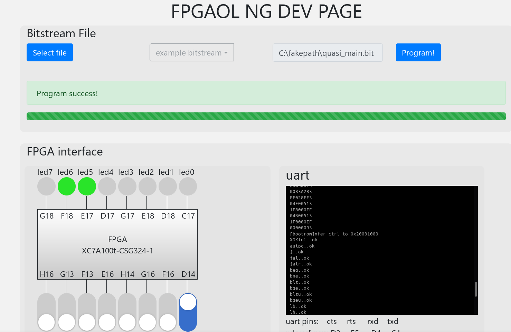

## Quasi SoC @ USTC FPGAOL

*Outsiders may find this less useful*

As of 2022.1 early-stage dev

fpgaol.ustc.edu.cn

`eda_projects/pCPU-ustc-fpgaol-vivado/vivado.tcl` create project.

`rtl/board-specific/ustc-fpgaol/` top design file, see quasi.vh for enabled parts(most disabled), currently half of all BRAMs(256KB if calculated correct) used as main memory.

D14 button controls reset, need to slide on then off on start, then you'll see UART output.

LEDs are PWM-driven so look strange.

Paste your "firmware"'s' `xxd -p` result into UART(wait till finish), add a space, then Enter. Now `software/tests/` works. RAM *may* no enough for CoreMark. 

